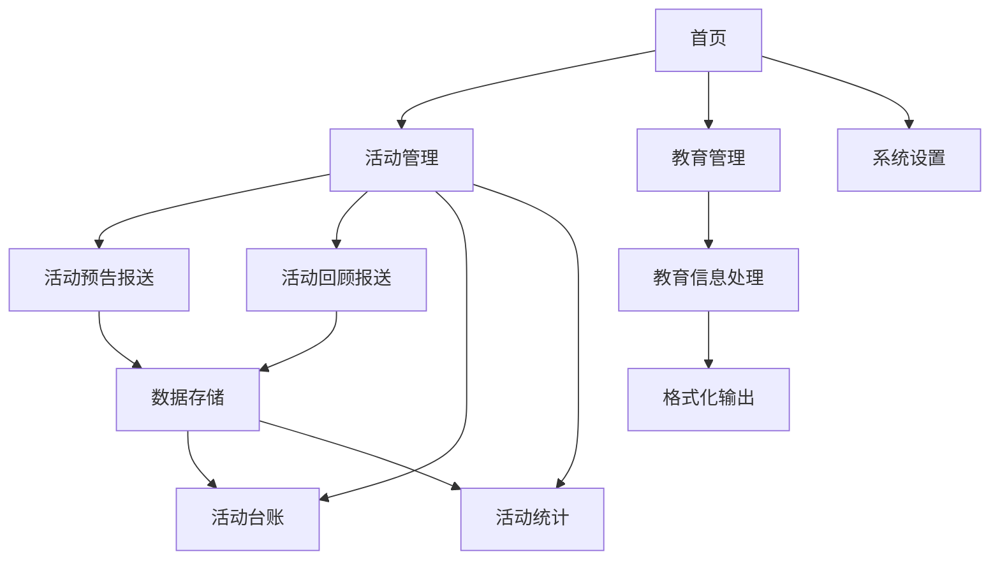

## 1. 产品概述

街道工作管理系统是一款专为街道工作人员设计的轻量级Web应用，旨在解决活动报送、教育信息处理等重复性工作效率低下的问题。系统采用纯前端架构，无需安装，浏览器即可运行，特别适合低配置电脑使用。

**目标用户**：街道工作人员
**核心价值**：提升工作效率，减少重复劳动，实现数据规范化管理

## 2. 核心功能

### 2.1 功能模块

1. **首页（仪表盘）**：待办事项提醒、快捷入口、最近操作记录
2. **活动预告报送**：活动预告录入、批量导入、列表管理
3. **活动回顾报送**：活动回顾录入、关联预告、列表管理
4. **活动台账**：时间段筛选、台账生成、导出Excel
5. **活动统计**：月度统计、社区排名、图表展示
6. **教育信息处理**：Excel解析、格式化处理、结果导出
7. **系统设置**：社区配置、数据管理

### 2.2 页面详情

| 页面名称 | 模块名称 | 功能描述 |
|---------|---------|---------|
| 首页 | 待办提醒 | 根据日期自动提醒报送任务（周三预告、周二回顾等） |
| 首页 | 快捷入口 | 各功能模块快速访问入口 |
| 首页 | 最近操作 | 显示最近5条操作记录 |
| 活动预告报送 | 表单录入 | 支持单条活动预告录入（社区、活动名称、时间、地点等） |
| 活动预告报送 | 批量导入 | 支持Excel文件上传和文字粘贴批量导入 |
| 活动预告报送 | 列表管理 | 预告列表展示、筛选、编辑、删除 |
| 活动回顾报送 | 表单录入 | 支持活动回顾录入，可关联预告信息 |
| 活动回顾报送 | 批量导入 | 支持批量导入回顾数据 |
| 活动回顾报送 | 列表管理 | 回顾列表展示、筛选、编辑、删除 |
| 活动台账 | 时间筛选 | 按时间段筛选活动数据 |
| 活动台账 | 台账生成 | 自动汇总生成标准化台账表格 |
| 活动台账 | 导出功能 | 导出Excel格式台账 |
| 活动统计 | 月度统计 | 按月统计各社区活动数量、参与人数 |
| 活动统计 | 社区排名 | 生成社区活动排名表 |
| 活动统计 | 图表展示 | 柱状图、饼图展示统计数据 |
| 教育信息处理 | 数据输入 | 支持Excel粘贴和文件上传 |
| 教育信息处理 | 格式化处理 | 按标准格式转换数据 |
| 教育信息处理 | 结果导出 | 导出格式化后的数据 |
| 系统设置 | 社区配置 | 管理12个社区的基础信息 |
| 系统设置 | 数据管理 | 数据备份、恢复、导入、清空 |

## 3. 核心流程

### 3.1 活动预告报送流程
用户进入活动预告报送页面 → 选择录入方式（单条/批量） → 填写/导入预告信息 → 系统验证数据 → 保存到本地存储 → 显示在预告列表中

### 3.2 活动台账生成流程
用户进入活动台账页面 → 选择时间范围 → 系统自动汇总该时间段内的活动预告和回顾 → 生成标准化台账表格 → 用户预览并导出Excel

### 3.3 月度统计流程
系统读取上月所有活动数据 → 按社区统计活动数量和参与人数 → 计算排名 → 生成统计图表 → 用户查看并导出报告



## 4. 用户界面设计

### 4.1 设计风格

**主题色彩**：
- 主色调：深蓝色 #1e3a5f（稳重、专业）
- 辅助色：浅蓝色 #4a90d9（清新、活力）
- 强调色：橙色 #f5a623（提醒、重要）
- 背景色：浅灰 #f5f7fa（舒适、护眼）
- 文字色：深灰 #333333

**按钮样式**：
- 主按钮：圆角矩形，深蓝背景，白色文字
- 次按钮：圆角矩形，白色背景，深蓝边框
- 危险按钮：红色背景

**字体**：
- 标题：思源黑体 / Source Han Sans，18-24px
- 正文：系统默认字体，14-16px
- 表格：等宽字体，14px

**布局风格**：
- 左侧固定导航栏（200px宽）
- 右侧内容区域（自适应）
- 卡片式内容展示
- 顶部面包屑导航

**图标风格**：
- 使用简洁的线性图标
- 配合文字说明

### 4.2 页面设计概览

| 页面名称 | 模块名称 | UI元素 |
|---------|---------|--------|
| 首页 | 待办提醒 | 卡片式布局，橙色提醒标签，时间图标 |
| 首页 | 快捷入口 | 4x2网格布局，图标+文字按钮 |
| 活动预告报送 | 表单区域 | 白色卡片，表单字段垂直排列，底部操作按钮 |
| 活动预告报送 | 列表区域 | 表格布局，支持排序筛选，操作列右对齐 |
| 活动台账 | 筛选区域 | 日期选择器，查询按钮 |
| 活动台账 | 台账预览 | 大表格，支持横向滚动，打印预览样式 |
| 活动统计 | 图表区域 | 柱状图、饼图，响应式大小 |
| 教育信息处理 | 输入区域 | 大文本框，支持拖拽上传 |
| 教育信息处理 | 输出区域 | 格式化预览，复制按钮 |

### 4.3 响应式设计

- 采用桌面优先设计，主要适配1280px及以上屏幕
- 导航栏在小屏幕下可折叠为汉堡菜单
- 表格支持横向滚动
- 表单在小屏幕下改为单列布局

## 5. 数据结构

### 5.1 社区信息
```javascript
{
  id: string,          // 社区ID
  name: string,        // 社区名称
  order: number        // 排序
}
```

### 5.2 活动预告
```javascript
{
  id: string,          // 预告ID
  communityId: string, // 社区ID
  activityName: string,// 活动名称
  activityType: string,// 活动类型
  startTime: string,   // 开始时间
  endTime: string,     // 结束时间
  location: string,    // 活动地点
  description: string, // 活动描述
  expectedParticipants: number, // 预计参与人数
  contactPerson: string, // 联系人
  contactPhone: string,  // 联系电话
  createTime: string,  // 创建时间
  status: string       // 状态：pending/reviewed/completed
}
```

### 5.3 活动回顾
```javascript
{
  id: string,          // 回顾ID
  forecastId: string,  // 关联预告ID
  communityId: string, // 社区ID
  activityName: string,// 活动名称
  actualStartTime: string, // 实际开始时间
  actualEndTime: string,   // 实际结束时间
  actualParticipants: number, // 实际参与人数
  summary: string,     // 活动总结
  photos: string[],    // 照片列表
  videos: string[],    // 视频列表
  createTime: string   // 创建时间
}
```

### 5.4 教育信息
```javascript
{
  id: string,
  communityId: string,
  title: string,       // 教育主题
  content: string,     // 教育内容
  date: string,        // 教育日期
  participants: number,// 参与人数
  location: string     // 地点
}
```
