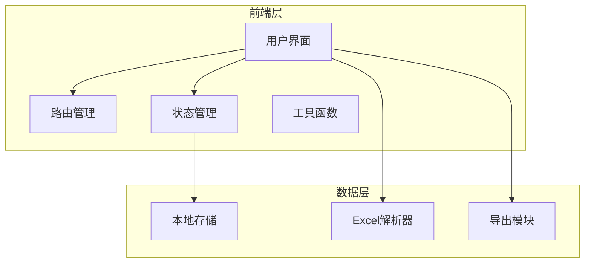
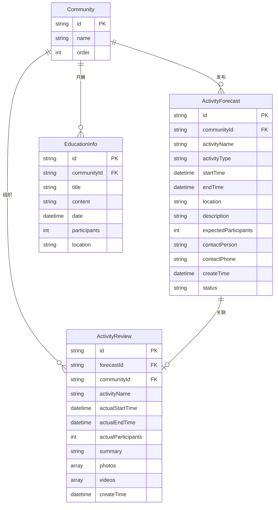

## 1. 架构设计



## 2. 技术说明

- **前端框架**：React 18 + TypeScript
- **样式方案**：Tailwind CSS 3
- **构建工具**：Vite
- **路由**：React Router 6
- **图表库**：Recharts（轻量级）
- **Excel处理**：SheetJS (xlsx)
- **数据存储**：localStorage
- **后端**：无（纯前端应用）

## 3. 路由定义

| 路由 | 页面 | 说明 |
|-----|------|------|
| `/` | 首页 | 仪表盘，待办提醒、快捷入口 |
| `/activity/forecast` | 活动预告报送 | 预告录入和管理 |
| `/activity/review` | 活动回顾报送 | 回顾录入和管理 |
| `/activity/ledger` | 活动台账 | 台账生成和导出 |
| `/activity/statistics` | 活动统计 | 统计分析和排名 |
| `/education` | 教育信息处理 | 教育数据格式化 |
| `/settings` | 系统设置 | 社区配置、数据管理 |

## 4. 项目结构

```
street-work-system/
├── public/
│   └── index.html
├── src/
│   ├── components/        # 公共组件
│   │   ├── Layout/        # 布局组件
│   │   ├── Sidebar/       # 侧边栏
│   │   ├── Header/        # 顶部导航
│   │   ├── Table/         # 表格组件
│   │   ├── Form/          # 表单组件
│   │   └── Modal/         # 弹窗组件
│   ├── pages/             # 页面组件
│   │   ├── Home/          # 首页
│   │   ├── Activity/      # 活动管理
│   │   │   ├── Forecast/  # 活动预告
│   │   │   ├── Review/    # 活动回顾
│   │   │   ├── Ledger/    # 活动台账
│   │   │   └── Statistics/# 活动统计
│   │   ├── Education/     # 教育管理
│   │   └── Settings/      # 系统设置
│   ├── hooks/             # 自定义Hooks
│   ├── utils/             # 工具函数
│   │   ├── storage.ts     # 存储工具
│   │   ├── excel.ts       # Excel处理
│   │   ├── export.ts      # 导出功能
│   │   └── date.ts        # 日期处理
│   ├── types/             # TypeScript类型定义
│   ├── constants/         # 常量定义
│   ├── App.tsx            # 应用入口
│   └── main.tsx           # 主入口
├── package.json
├── vite.config.ts
├── tailwind.config.js
└── tsconfig.json
```

## 5. 数据模型

### 5.1 数据模型定义



### 5.2 localStorage 数据结构

```typescript
interface StorageData {
  communities: Community[];
  activityForecasts: ActivityForecast[];
  activityReviews: ActivityReview[];
  educationInfos: EducationInfo[];
  recentOperations: Operation[];
  settings: Settings;
}
```

## 6. 核心功能实现

### 6.1 待办提醒逻辑

```typescript
const getTodoList = () => {
  const today = new Date();
  const dayOfWeek = today.getDay();
  const date = today.getDate();
  const todos = [];
  
  if (dayOfWeek === 3) {
    todos.push({ task: '本周末活动预告报送', deadline: '今日' });
  }
  
  if (isThursdayOfEvenWeek(today)) {
    todos.push({ task: '下两周活动预告报送', deadline: '今日' });
  }
  
  if (isTuesdayOfEvenWeek(today)) {
    todos.push({ task: '周末活动回顾报送', deadline: '今日' });
  }
  
  if (isFridayOfEvenWeek(today)) {
    todos.push({ task: '上两周活动回顾报送', deadline: '今日' });
  }
  
  if (date === 20) {
    todos.push({ task: '生成上月活动台账', deadline: '今日' });
  }
  
  if (date === 25) {
    todos.push({ task: '生成本月回顾资料合集', deadline: '今日' });
  }
  
  if (date === 1) {
    todos.push({ task: '上月活动统计分析', deadline: '今日' });
  }
  
  return todos;
};
```

### 6.2 Excel导入导出

使用SheetJS库实现：
- 导入：解析Excel文件为JSON数据
- 导出：将JSON数据转换为Excel文件下载

### 6.3 数据持久化

使用localStorage存储所有数据：
- 数据自动保存
- 支持数据备份（导出JSON文件）
- 支持数据恢复（导入JSON文件）

## 7. 性能优化策略

1. **代码分割**：按路由懒加载页面组件
2. **虚拟列表**：大数据量表格使用虚拟滚动
3. **防抖节流**：搜索、筛选操作使用防抖
4. **缓存策略**：频繁访问的数据缓存到内存
5. **按需加载**：图表库按需引入

## 8. 浏览器兼容性

- Chrome 80+
- Firefox 75+
- Edge 80+
- Safari 13+

## 9. 部署方案

### 方案一：静态文件部署
- 构建产物为纯静态文件
- 可部署到任意Web服务器
- 支持本地文件打开（file://协议）

### 方案二：本地运行
- 无需服务器
- 直接打开index.html即可使用
- 数据存储在浏览器本地
